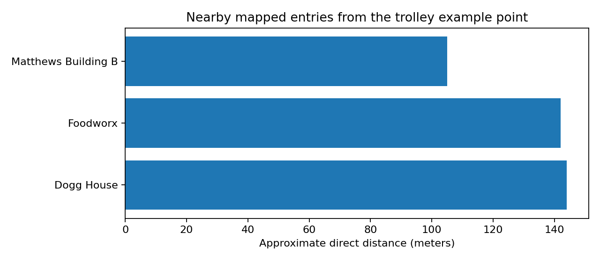

# Triton Refill

Find a nearby water station at UC San Diego.

**[Launch Triton Refill](https://experience.arcgis.com/experience/e5cdd600df2146a3a2d6cdd035e79d67)** · [Read the Code and Explanations](Triton_Refill.ipynb)

## What you can do

- Find water stations near your location or a place you choose.
- Read details about where to find each station.
- Get directions to a station.
- Look around nearby areas using Street View.
- Send a station report and add a photo if you want.

Reports appear in a private dashboard—a screen where the project owner can review submissions.

## How it works

| Tool | What it does |
| --- | --- |
| Python | Cleans the station list and checks a nearby search. |
| ArcGIS Online | Stores the station information and map. |
| Experience Builder | Builds the app’s screen and tools. |
| Survey123 | Provides the form for reports and photos. |
| ArcGIS Dashboards | Displays reports for the project owner. |
| Google Maps Embed API | Shows Google Street View inside the app. |

The app runs in ArcGIS. This GitHub repository holds the code, example files, and instructions.

The Python notebook prepares the station list and demonstrates how to find nearby stations. The app does not run that notebook every time someone clicks the map.

## Try the code

A notebook is a file with code and explanations together. This one explains each step in simple language.

1. Download `Triton_Refill.ipynb`.
2. Open [Google Colab](https://colab.research.google.com/) and upload the notebook.
3. Run each code block in order, starting at the top.

The station list is already included. You do not need an ArcGIS account or a Google Maps key to run the notebook.

The notebook saves the cleaned list, check results, example search results, and a blank visit log as CSV files. These are tables that spreadsheet programs can open.

The last block downloads the main station list to your computer.

**Using Jupyter instead?** Install the tools listed in `requirements.txt` and skip the last download block. The saved files will be in the folder where the notebook runs.

## What the notebook found

| Item | Result |
| --- | --- |
| Entries in the cleaned station list | 84 |
| Missing descriptions | 31 |
| Exact repeated entries removed | 0 |
| Search checks passed | 6 |

Missing descriptions were filled with **“No details provided.”**

The duplicate check found no exact repeats to remove.

Shorter bars mean closer stations. This chart uses an example starting location and straight-line distances.

## Things to know

- Straight-line distances do not follow sidewalks or go around buildings. Walking routes may be longer.
- Current station conditions and building access have not been confirmed.
- Street View may show a nearby road or path instead of the exact water station.
- Stations with no usable Street View are marked manually. The app does not automatically check Google for missing pictures.
- The search checks test the code. The campus-visit log is still blank.

## Where to find things

| File or folder | What is inside |
| --- | --- |
| `Triton_Refill.ipynb` | The code and explanations |
| `requirements.txt` | Python tools needed to run the notebook locally |
| `data/` | Station list, check results, example results, and blank visit log |
| `images/` | The example chart |
| `docs/app-setup.md` | Notes about building the app |
| `docs/github-upload-guide.md` | Steps for uploading this project to GitHub |

## Problems we found and how we fixed them

While building the app, we ran into problems with directions, reports, and Street View. Some things that looked broken were actually working correctly.

This explains what happened, what we changed, and why.

## 1. Some stations had no description

**What happened:** Some stations had a name and a map location, but no extra details about where to find the water station.

**What we did:** The notebook filled 31 empty descriptions with “No details provided.” We kept 84 stations and checked for exact repeats.

**Why:** A station can still be useful without a description. We kept it on the map and made it clear that more details were missing.

## 2. A nearby station may take longer to walk to

**What happened:** The notebook measures distance in a straight line. It does not follow sidewalks or go around buildings.

**What we did:** Explained that the notebook shows straight-line distances and included the Directions tool in the app for route requests.

**Why:** A water station might be close but have its entrance on the other side of a building. “Closest on the map” does not always mean “quickest to walk to.”

## 3. Directions asked people to sign in

**What happened:** People could open the app, but Directions still asked them to sign in to ArcGIS.

**What we did:** Connected Directions to Route_World, the service that calculates routes. In the publishing settings, we authorized it under “Subscriber contents.”

We also removed an extra address-search source that was not working.

**Why:** Opening the app and getting a route depended on separate access settings. Making the app public did not automatically give visitors access to the route service.

**Result:** Directions worked without a sign-in request during testing.

Route requests can use ArcGIS credits from the account providing the service.

## 4. A route-service page showed an error

**What happened:** Opening the route service’s address in a browser showed a 403 error and said its Services Directory was disabled.

**What we did:** Tested Directions inside the app after fixing its access settings.

**Why:** A blocked service-information page did not necessarily mean the app could not ask for a route. We needed to test the feature people would actually use.

**Result:** Directions worked. We did not change the administrator’s directory setting.

## 5. The report numbers looked wrong

**What happened:** The dashboard showed two total reports, but zero Working, Not Working, and Cannot Access reports.

**What we checked:** Opened the two reports and looked at their selected status.

**What we found:** Both were marked “Other.” Neither belonged in the three displayed status counts.

**Why we kept the counts:** They were correct. We checked what the reports actually said before changing how the dashboard counted them.

## 6. Practice reports appeared in the results

**What happened:** Two submissions were made to test the form and photo upload. They did not describe verified station conditions.

**What we did:** Added a filter that hides those two test reports from the report display. The saved reports were kept.

**Why:** Someone reviewing the dashboard should not mistake a practice submission for a real problem at a station.

**What happens later:** Real reports should appear normally. If we submit more practice reports, we need to identify and hide those too. We do not need to hide each genuine report.

## 7. Anyone needed to report a problem, but report review stayed private

**What we needed:** Visitors should be able to submit a report without signing in. The stored reports and review dashboard should stay private.

**What we did:** Kept the survey and its submission view public.

A view provides access to the same saved data but can have different access settings.

We kept the original report data, results view, reports map, and dashboard private.

**Why:** Permission to send a new report is different from permission to read or change existing reports. Turning editing off everywhere could also stop people from submitting the form.

**Result:** Submission without signing in, photo upload, and the report-permission checks were completed.

## 8. We checked that uploaded photos actually appeared

**What we tested:** Submitted a clearly labeled practice report with a photo, then opened that report in the dashboard.

**What happened:** The photo appeared under “Submitted Photos,” with the report information.

**Why:** Seeing “submitted” on the form was only part of the test. We also needed to know that the person reviewing reports could see the picture.

This checked the upload process. It did not verify the condition of a real water station.

## 9. Different stations showed the same wrong Street View

**What happened:** Center Hall and Medical Teaching Facility both showed Muir Lane, far from their map markers.

**What we found:** Their saved locations were correct, but the numbers sent to Google were rounded too much.

Latitude and longitude are the two numbers that identify a place on the map. They were being displayed with only two numbers after the decimal point.

For example:

`32.878150` became `32.88`

Different stations could end up sending Google the same rounded location.

**What we did:** In Map Viewer, we set both latitude and longitude to six decimal places. We turned off the thousands separator, saved the map, and refreshed the app.

**Why:** We checked the location Google was receiving before moving any station markers.

**Result:** Retesting confirmed that the wrong-location problem was fixed.

## 10. Street View showed a link before a station was selected

**What happened:** The Street View box could show an unfinished web address when no station had been clicked.

**What we did:** Connected the box to the selected station and set its starting message to:

> Select a station to view Street View.

**Why:** The box needs to know which station to show. Until someone selects one, it should explain what to do.

## 11. The Google key had extra text attached

**What happened:** The code’s key value included extra pieces of the web address, such as `key=` and `&location=,`.

The API key is the code Google uses to identify the project asking for Street View.

**What we did:** Used only the key itself as the key value. The rest of the code built the web address around it.

**Why:** Adding the same pieces twice made the address incorrect.

For shared examples, `YOUR_API_KEY` can stand in for the actual key.

## 12. A new formula made Street View turn black

**What happened:** After we created saved Street View links, stations that had worked started showing a black screen.

**What we found:** An early formula for writing the location numbers accidentally removed digits from the beginning.

For Biomed Library, the correct location was approximately:

`32.875535,-117.236663`

The formula wrote:

`2.875535,-7.236663`

Those numbers point somewhere completely different.

The original station locations and map markers were still correct. The newly created links were wrong.

**What we did:** Changed the number format from `"0.000000"` to `"#.000000"` in Arcade, the language used for this ArcGIS calculation.

We rebuilt the links using the original station locations. The repair kept the existing Google key and left intentionally empty links empty.

**Why:** The corrected format kept the full location number and six decimal places.

**Result:** Street View worked after recalculating the links and refreshing the app.

**What we learned:** “No errors” in the preview only means the code can run. We still need to look at what it produces and check that the numbers are right.

## 13. A station without Street View needed a useful message

**What happened:** When a station had no usable Street View, the box could leave the previous view showing or give an unclear result.

Revelle - Rogers Market was the example we identified.

**What we wanted:** Show this message:

> Street View is not available at this location.

We also wanted to keep the solution inside ArcGIS Online, without building and hosting another website.

**What we did:**

1. Added a column named `streetview_url` to the station data. Its displayed name is “Street View link.” ArcGIS calls a column a field.
2. Stored a complete Street View web address for each station.
3. Left Rogers Market’s link empty because no usable view had been identified.
4. Told the Embed widget—the box that displays Street View—to use only the selected station’s saved link.
5. Set the widget’s “Blank message” to the unavailable message above.

**Why:** The widget can show a message when the selected station has an empty link. This gave us the behavior we wanted using the existing app.

**Result:** The final app preview showed the message when Rogers Market was selected.

**What this does not do:** It does not automatically check Google for missing pictures. We check a station ourselves and clear its link if no usable view is available. The message then appears whenever someone selects that station.

## What the Street View box should show

| What someone does | What they should see |
| --- | --- |
| Opens Street View before choosing a station | Select a station to view Street View. |
| Chooses a station with a working link | Nearby Street View pictures |
| Chooses a station whose link was left empty | Street View is not available at this location. |

The links ask Google for pictures within 50 meters.

The camera may have been on a nearby road or path, so the picture may not show the exact water station, especially if it is indoors.

If a saved link later stops loading, it needs another check. The empty-link message does not catch every loading problem.

## What we learned from building the app

- Look at the saved information before changing the app.
- Check what is actually sent to another service, such as Google.
- A correct map marker can still have an incorrect Street View link.
- Test what happens when information is missing, as well as when everything works.
- Keep practice submissions separate from real reports.
- Keep public submission and private review settings separate.
- Choose fixes that we can maintain in ArcGIS Online.

## How we check the app after changes

Manual testing confirmed that directions, reporting, photo uploads, and the repaired Street View worked.

The final builder preview showed the unavailable message for Rogers Market.

After making changes, save and publish the app so visitors receive them. Then open the public app and check it again.

For Street View, click:

1. A station with working pictures.
2. A station marked unavailable.
3. Another station with working pictures.

Each selection should replace what was showing before.

The notebook also recorded six passing search checks. These checked the code. They did not confirm that every station is working or that every building is open.

The blank campus-visit sheet contains no completed visits.

## What to do if another station has no usable Street View

Find that station’s row in the data table and clear only its “Street View link.”

Keep the station and its location on the map.

Its empty link will make the unavailable message appear. If pictures become available later, its link can be restored after checking them.

When repairing or rebuilding links, preserve the ones deliberately left empty. Otherwise, the unavailable message may stop appearing for those stations.

## Where the station list came from

The locations came from [UCSD Hydration Locations](https://www.google.com/maps/d/viewer?mid=18OFCg3GFp6wl5mCwioSvU9fdGAA&usp=sharing), linked by [UCSD HDH Sustainability](https://hdhsustainability.ucsd.edu/).

This project uses a saved copy. The original map’s last update date is unknown.

Credit for the source data belongs to its owners. More sources are listed in the notebook.
